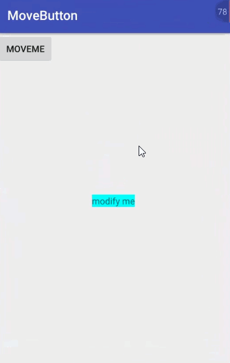
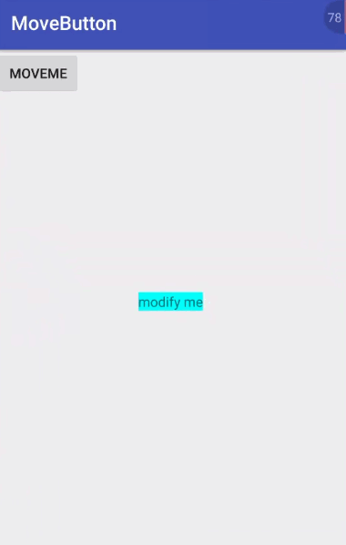

# MoveButton
##方案一 使用layout来修改View的位置
###效果图

###代码
 @Override
    public boolean onTouch(View v, MotionEvent event) {

        switch(event.getAction()){
            case MotionEvent.ACTION_DOWN:
                mIsClick = false;
                mLastX=(int)event.getRawX();//获取触摸事件触摸位置的原始X坐标
                mLastY=(int)event.getRawY();
                break;

            case MotionEvent.ACTION_MOVE:
                mIsClick=true;

                int dx=(int)event.getRawX()-mLastX;
                int dy=(int)event.getRawY()-mLastY;

                int l=v.getLeft()+dx;
                int b=v.getBottom()+dy;
                int r=v.getRight()+dx;
                int t=v.getTop()+dy;

                if(l<0){
                    l=0;
                    r=l+v.getWidth();
                }

                if(t<0){
                    t=0;
                    b=t+v.getHeight();
                }

                if(r>mRlayout.getWidth()){
                    r=mRlayout.getWidth();
                    l=r-v.getWidth();
                }

                if(b>mRlayout.getHeight()){
                    b=mRlayout.getHeight();
                    t=b-v.getHeight();
                }
                v.layout(l, t, r, b);

                mLastX=(int)event.getRawX();
                mLastY=(int)event.getRawY();

                v.postInvalidate();
                break;
            case MotionEvent.ACTION_UP:
                break;
        }
        return mIsClick;
    }
但是这种方式有个缺点，就是点击其它页面的元素，如果发生更改就会复位。

如果更改页面的其它View，能不能不复位呢？

答案是可以的，这就需要我们下边的解决方案

##方案二 通过setLayoutParams
###效果图

###代码
 //拖动事件处理
    @Override
    public boolean onTouch(View v, MotionEvent event) {

        if (v.getId() != R.id.btnOverHand)
            return true;
        switch (event.getAction()) {
            case MotionEvent.ACTION_DOWN:
                //v.setBackgroundResource(R.mipmap.btn_style_one_press);
                mIsClick = false;//当按下的时候设置isclick为false，具体原因看后边的讲解
                mLastX = (int) event.getRawX();
                mLastY = (int) event.getRawY();//按钮初始的横纵坐标

                break;
            case MotionEvent.ACTION_MOVE:
                mIsClick = true;//当按钮被移动的时候设置isclick为true
                float currentX = event.getRawX();
                float currentY = event.getRawY();
                RelativeLayout.LayoutParams layoutParams = (RelativeLayout.LayoutParams) v.getLayoutParams();
                int dx = (int) (currentX - mLastX);
                int dy = (int) (currentY - mLastY);//按钮被移动的距离
                int l =layoutParams.leftMargin + dx;
                int t = layoutParams.topMargin + dy;
                int b =mRlayout.getHeight()- t-v.getHeight();
                int r =mRlayout.getWidth()- l-v.getWidth();
                if (l < 0) {//处理按钮被移动到上下左右四个边缘时的情况，决定着按钮不会被移动到屏幕外边去
                    l = 0;
                    r =mRlayout.getWidth()-v.getWidth();
                }
                if (t < 0) {
                    t = 0;
                    b = mRlayout.getHeight()-v.getHeight();
                }

                if (r<0) {
                    r =0;
                    l = mRlayout.getWidth()-v.getWidth();
                }
                if (b<0) {
                    b = 0;
                    t = mRlayout.getHeight()-v.getHeight();
                }
                layoutParams.leftMargin = l;
                layoutParams.topMargin = t;
                layoutParams.bottomMargin = b;
                layoutParams.rightMargin = r;

                v.setLayoutParams(layoutParams);
                mLastX = (int) currentX;
                mLastY = (int) currentY;
                v.postInvalidate();
                break;
            case MotionEvent.ACTION_UP:
                break;
            default:
                break;
        }
        return mIsClick;
    }
我们可以看到点击文本modify me时，移动的按钮是没有复位的

##对比
方案一 通过layout来更改view的位置

方案二 通过setLayoutParams来更改view的位置

两种都可以实现view移动，但是在方案一中，如果更改页面的其它view时，会复位，产生这个现象的原因，在于更改页面的view时，会触发父布局重绘，但是通过view自已通过layout后，父布局并不知道子view发生改变，所以父布局重新触发layout时，还是按以前的来计算布局

但是通setLayoutParams来更改view的位置，则父布局可以知道子view发生改变

